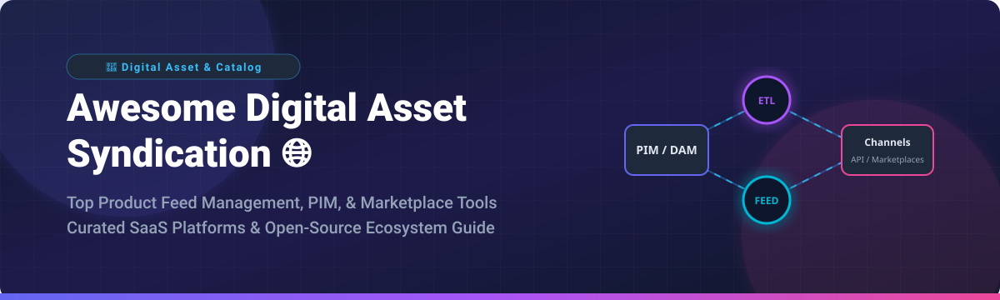
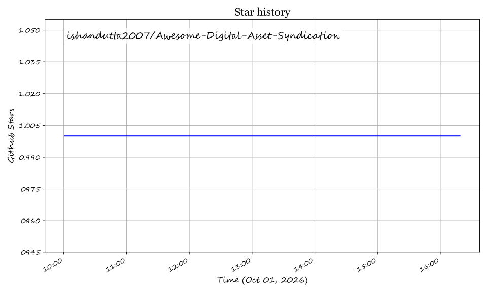

# Awesome Digital Asset Syndication 🚀

[](https://github.com/ishandutta2007/Awesome-Digital-Asset-Syndication)

## 🌐 Top Digital Asset & Catalog Syndication Ecosystem

**Curated List of Enterprise SaaS Platforms & Open-Source GitHub Projects**  
*Focused on Product Feed Management, Marketplace Syndication, Channel Listing, PIM-to-Channel Distribution & E-commerce Catalog Syndication.*

<a href="https://github.com/ishandutta2007/Awesome-Awesome-Awesome"></a><a href="https://discord.gg/jc4xtF58Ve"></a>
[](https://github.com/ishandutta2007/Awesome-Awesome-Awesome)
[](https://opensource.org/licenses/MIT)
[](http://makeapullrequest.com)
<a href="https://github.com/ishandutta2007"></a>

**Last updated: October 2026**

---

### 📌 Overview & Scope

This repository tracks notable **SaaS platforms** and **open-source projects** for **Digital Asset & Product Syndication**. These solutions empower e-commerce brands, manufacturers, and retailers to transform central product data and digital assets into channel-specific listings for global marketplaces (Amazon, eBay, Walmart), ad networks (Google Shopping, Meta Ads), and retail partners.

* **Commercial Enterprise SaaS**: Category leaders provide end-to-end turnkey marketplace integrations, dynamic data feed optimization, inventory synchronization, and managed channel APIs.
* **Open-Source Foundations**: Open-source strengths lie in **Product Information Management (PIM)** systems (Akeneo, Pimcore, AtroPIM) combined with **ETL/Workflow Automation** tools (n8n, Airbyte, Apache NiFi) to build custom composable syndication pipelines.

---

## 📑 Table of Contents
- [📊 SaaS & Hosted Platforms](#-saas--hosted-platforms)
  - [Market Analysis & Structure](#market-analysis--structure)
  - [SaaS Products Comparison](#saas-products-comparison)
- [🔓 Open-Source GitHub Projects](#-open-source-github-projects)
  - [Top Open-Source Repositories](#top-open-source-repositories)
  - [Architectural Patterns for Open Syndication](#architectural-patterns-for-open-syndication)
- [🤝 How to Contribute](#-how-to-contribute)
- [💖 Support & Sponsorship](#-support--sponsorship)
- [📈 Star History](#-star-history)
- [⚠️ Disclaimer](#️-disclaimer)

---

## 📊 SaaS & Hosted Platforms

### Market Analysis & Structure
> **Market Size & Fragmentation**: The global Product Information Management (PIM) and Digital Asset / Product Syndication software market is estimated at **$11.5 Billion to $14.2 Billion** (2025/2026), growing at a CAGR of ~15-18%. The sector is **moderately fragmented**: enterprise players (like Salsify, Productsup, and BigCommerce/Feedonomics) dominate high-volume omnichannel brand distribution, while mid-market specialized players (ChannelEngine, Channable, DataFeedWatch) capture specific marketplace and regional connector niches without a single winner-take-all monopoly.

### SaaS Products Comparison

The table below details top commercial feed management and catalog syndication platforms, sorted by estimated company revenue / valuation in descending order:

| 🏢 Platform | 💰 Estimated Revenue / Valuation | 🏷️ Starting Pricing Tier | 🆓 Free Plan / Trial Limit | 📝 Description & Strengths |
| :--- | :--- | :--- | :--- | :--- |
| **[Salsify](https://www.salsify.com/)** | **$200M - $300M ARR**<br>*(Valuation: ~$2.0B)* | ~$10,000+/year *(Custom Enterprise quote based on SKU count & seats)* | **No free trial**<br>*(Sales Demo only)* | Enterprise Product Experience Management (PXM) & digital asset syndication built for omnichannel brands. |
| **[Productsup](https://www.productsup.com/)** | **~$63M ARR**<br>*(Valuation: ~$50M - $100M)* | ~$500+/month *(Custom quote based on channel feeds & SKU volume)* | **No free trial**<br>*(Sales Demo only)* | Enterprise product data syndication platform supporting 2,500+ marketplace & ad channel feeds. |
| **[ChannelEngine](https://www.channelengine.com/)** | **~$46.8M ARR**<br>*(Raised $50M Series B)* | Custom GMV + Monthly License *(Onboarding fee + % of channel GMV)* | **No free trial**<br>*(Dev accounts available for existing clients)* | Global marketplace integration management connecting merchants directly to 200+ international sales channels. |
| **[Channable](https://www.channable.com/)** | **$21M - $46.7M ARR**<br>*(Raised €55M Series B)* | **$35/month** *(Base tier scaling by items & active channels)* | **Free unlimited setup account**<br>*(Requires paid plan to activate live channel export)* | Multichannel feed management and PPC ad automation platform with flexible rules & template engines. |
| **[Feedonomics](https://feedonomics.com/)** *(Acquired by BigCommerce)* | **~$15M - $25M ARR**<br>*(Acquired for $145M)* | ~$199+/month *(Quote-based on SKU volume & managed service level)* | **No free trial**<br>*(Sales Demo first; free surface tiers on BigCommerce)* | Full-service marketplace feed management platform handling catalog governance and order routing. |
| **[DataFeedWatch](https://www.datafeedwatch.com/)** *(Acquired by Cart.com)* | **~$11.2M Revenue** | **$64/month** *(Shop plan for 1,000 SKUs & 3 channels)* | **15-day free trial**<br>*(Full platform feature access)* | Intuitive catalog feed creation and optimization software for Google Shopping, Amazon, & social channels. |
| **[CedCommerce](https://cedcommerce.com/)** | **~$5M - $10M Revenue** | **$9 - $29/month** *(Per-connector app subscription)* | **7 to 14-day free trial**<br>*(Varies by marketplace connector app)* | E-commerce channel integration software specializing in Shopify/WooCommerce to Walmart, eBay, & Etsy sync. |
| **[Shoppingfeed](https://www.shopping-feed.com/)** *(Centric Software)* | **~$3M - $5M Revenue** | **$399/month** *(Standard multi-channel package)* | **14-day free trial**<br>*(Demo / trial available upon request)* | All-in-one product feed management tool automating inventory sync and listings for global marketplaces. |
| **[GoDataFeed](https://www.godatafeed.com/)** | **~$2.0M - $2.2M Revenue** | **$39/month** *(Lite plan for 1,000 SKUs & 1 feed)* | **14-day free trial**<br>*(Includes 1 PPC feed setup)* | Lightweight feed automation service transforming catalog files into submission-ready feeds. |

---

## 🔓 Open-Source GitHub Projects

Open-source technologies form the backbone of self-hosted catalog master systems (PIM/DAM), data pipeline transformations (ETL/Workflows), and composable commerce endpoints.

### Top Open-Source Repositories

The table below lists the top open-source projects used in digital asset syndication pipelines, sorted by GitHub Stars_Count in descending order:

| 📦 Repository | ⭐ GitHub_Stars | 🎯 Primary Category | 📝 Description & Syndication Role |
| :--- | :--- | :--- | :--- |
| **[n8n](https://github.com/n8n-io/n8n)** | [](https://github.com/n8n-io/n8n/stargazers) | Workflow Automation | Fair-code workflow automation tool to connect PIM APIs, map catalog schemas, and push updates to marketplace endpoints. |
| **[Medusa](https://github.com/medusajs/medusa)** | [](https://github.com/medusajs/medusa/stargazers) | Headless Commerce | Open-source Node.js commerce engine with modular channel plugins for custom feed creation. |
| **[Activepieces](https://github.com/activepieces/activepieces)** | [](https://github.com/activepieces/activepieces/stargazers) | Workflow Automation | No-code business automation framework suitable for transforming catalog JSON exports into XML channel feeds. |
| **[Saleor](https://github.com/saleor/saleor)** | [](https://github.com/saleor/saleor/stargazers) | Headless Commerce | Modular GraphQL-driven headless commerce platform with native multi-channel and multi-warehouse capabilities. |
| **[Airbyte](https://github.com/airbytehq/airbyte)** | [](https://github.com/airbytehq/airbyte/stargazers) | Data Integration / ETL | Open data integration platform for moving product catalog data between databases, PIMs, and cloud storage. |
| **[Sylius](https://github.com/sylius/sylius)** | [](https://github.com/sylius/sylius/stargazers) | PHP Commerce | Open-source PHP/Symfony framework providing community connectors toward Google Merchant Center and eBay feeds. |
| **[Apache NiFi](https://github.com/apache/nifi)** | [](https://github.com/apache/nifi/stargazers) | Enterprise Data ETL | Robust data flow system designed to process, transform, and distribute heavy multi-gigabyte product XML/CSV feeds. |
| **[Pimcore](https://github.com/pimcore/pimcore)** | [](https://github.com/pimcore/pimcore/stargazers) | Open PIM / DAM / MDM | Enterprise open-source platform combining Product Information Management (PIM) and Digital Asset Management (DAM). |
| **[Shopware](https://github.com/shopware/shopware)** | [](https://github.com/shopware/shopware/stargazers) | E-commerce Core | Leading European open e-commerce platform offering native export channels and feed mapping tools. |
| **[Akeneo PIM Community](https://github.com/akeneo/pim-community-dev)** | [](https://github.com/akeneo/pim-community-dev/stargazers) | Product Information Management | The leading open-source PIM created to structure master catalog data before syndicating to channels. |
| **[AtroPIM](https://github.com/atrocore/atropim)** | [](https://github.com/atrocore/atropim/stargazers) | Open PIM Software | Flexible open-source PIM platform with channel-specific attributes and distribution-oriented data models. |

---

### 🛠️ Architectural Patterns for Open Syndication

```
 ┌────────────────┐     ┌──────────────────┐     ┌───────────────────┐     ┌──────────────────────┐
 │ Product Master │ ──> │ Transformation   │ ──> │ Format Validation │ ──> │ Syndication Delivery │
 │ (Akeneo/Pimcore│     │ Engine (n8n/NiFi)│     │ (Schema.org/GS1)  │     │ (Marketplaces/SFTP)  │
 └────────────────┘     └──────────────────┘     └───────────────────┘     └──────────────────────┘
```

1. **System of Record (Master Catalog)**: Deploy **Akeneo**, **Pimcore**, or **AtroPIM** as the central repository for product descriptions, asset files, and channel attributes.
2. **Data Pipeline & Mapping Engine**: Utilize **n8n**, **Airbyte**, or **Apache NiFi** to fetch PIM delta updates, execute mapping rules, and construct channel-compliant XML, JSON, or CSV feeds.
3. **Standards Validation**: Enforce standard product schemas ([Schema.org Product](https://schema.org/Product) or GS1 SmartSearch standards) to maximize feed approval rates on Google Merchant Center, Meta, and Amazon.
4. **Channel Delivery**: Push structured feed outputs to marketplace APIs, webhooks, or scheduled SFTP directory drops.

---

## 🤝 How to Contribute

Contributions are welcome to keep this list current and comprehensive! 

1. **Fork** this repository.
2. Add or update entries in `README.md` following the standardized table structure.
3. Ensure all links point directly to official documentation or primary GitHub repos.
4. Open a **Pull Request** with a clear explanation of your changes.

---

## 💖 Support & Sponsorship

Thank you for exploring and utilizing this curated open-source e-commerce resource! If you find this repository helpful for your projects, business, or team, please consider supporting the project:

- 🌟 **Star this repository** on GitHub to increase its visibility.
- 🔀 **Fork & Share** it with colleagues, developers, and e-commerce ops teams.
- ☕ **Buy Me a Coffee / Sponsor**: Consider sponsoring development via the [GitHub Sponsor Dashboard](https://github.com/sponsors/ishandutta2007).

---

## 📈 Star History

[](https://star-history.dera.page/#ishandutta2007/Awesome-Digital-Asset-Syndication&type=date&legend=top-left)

---

## ⚠️ Disclaimer

- This repository is a **community-curated guide** provided for informational purposes only.
- Marketplace feed requirements and taxonomy guidelines change frequently. Always consult official marketplace partner documentation (Google, Amazon, Walmart) to maintain account compliance.
- Open-source PIM solutions offer complete data control but require engineering maintenance for channel connectors. Enterprise SaaS platforms shift connector upkeep to vendors in exchange for subscription fees.

---

**Made with ❤️ for E-commerce Ops, PIM Managers, Marketplace Strategists, and Integration Engineers.**

## Star History

<a href="https://star-history.com/#ishandutta2007/Awesome-Digital-Asset-Syndication&Timeline" align="center">
  <picture>
    <source media="(prefers-color-scheme: dark)" srcset="assets/ishandutta2007_Awesome-Digital-Asset-Syndication_growth.svg">
    
  </picture>
</a>
